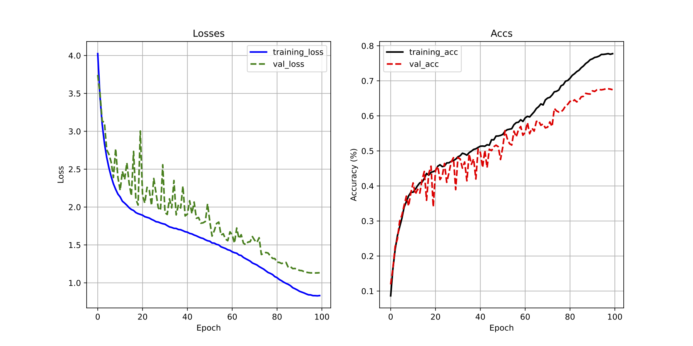

# Unofficial Implementation of  ***FocusedDropout for Convolutional Neural Network***

  
## Results Branch

### <font color = 'green'> Project Results for Reproducible Research </font> :bar_chart:

Created by: Kunhong Yu (444447)/Islam Islamov ()/Leyla Ellazova ()

- [Results Contents]()
	- [Results](#results)
		- [Accuracy in Tables](#accuracy-in-tables)
			- [CIFAR10 Accuracy](#cifar10-accuracy)
			- [CIFAR100 Accuracy](#cifar100-accuracy)
		- [Stats](#stats)
			- [CIFAR10 Stats](#cifar10-stats)
				- [VGG19Net](#vgg19net)
				- [DenseNet](#densenet)
				- [ResNet110](#resnet110)
			- [CIFAR100 Stats](#cifar100-stats)
				- [ResNet20](#resnet20)
				- [WRN28](#wrn28)
				- [ResNet56](#resnet56)
		- [CAM](#cam)
			- [CIFAR10 CAM](#cifar10-cam)
				- [ResNet56](#resnet56)
				- [ResNet110](#resnet110)
			- [CIFAR100 CAM](#cifar100-cam)
				- [ResNet20](#resnet20)
				- [ResNet110](#resnet110)
			- [Animation](#animation)
	- [Contributions](#contributions)


This branch will display all reproduced experiments' results.

For the code part, please refer to [code page](https://github.com/yuranusduke/FocusedDropoutCNN).

**NOTE: When you git this branch, please merge with main branch in local machine.**

## Results

If you refer to use pre-trained **everything**, please download our models [here](https://drive.google.com/file/d/1A4URXtEBpN95B3L6SQQjkOgkox1Afw43/view?usp=share_link), which is about 6GB in `zip` file, unzip it and keep file trees as they are, put them into `checkpoint` folder, in case there is no `checkpoint` folder, feel free to create one.

### Accuracy in Tables
When reproducing accuracies, just run 
```bash 
bash parse_full.sh
```

As we've mentioned in the `main` branch, we can not reproduce exact accuracy metrics due to ambuiguity of hyper-parameters in the paper, but we use off-the-shelf values in common computer vision field, the core thing is to reveal that their proposed algorithm (*i.e.*, FocusedDropout) can achieve SOTA classification accuracy compared to other methods in most cases. From below two tables, we successfully prove this.

#### CIFAR10 Accuracy
To mimic `Table1` and `Table2` in original paper, we run each experiment either two or three times and report its mean and standard deviation on testing data sets.

| Method              | ResNet20        | ResNet56| ResNet110 | VGGNet19 | DenseNet|WRN28 |
| :-----------------: | :-----------: |:-----------: |:-----------: |:-----------: |:-----------: |:-----------: |
| Baseline       	  |  92.01±0.07%     |   92.22±0.32%   |     |   93.35±0.1%   |      |      |
| Dropout             |  92.08±0.09%    |   92.86±0.29%   |        |   93.24±0.09%  |      |      |
| SpatialDropout      |  91.76±0.15% |   92.83±0.67%   |      |   93.37±0.13%   |     |      |
| DropoutBlock        |  92.01±0.07%  |  93.01±0.32%    |     |   93.35±0.1%   |     |     |
| FocusedDropout      |  <font color = 'red'>**92.94±0.06%**</font> |  <font color = 'red'>**93.05±0.99%**</font>   |      |    <font color = 'red'>**93.41±0.2%**</font>  |     |      |

#### CIFAR100 Accuracy

| Method              | ResNet20        | ResNet56| ResNet110 | VGGNet19 | DenseNet|WRN28 |
| :-----------------: | :-----------: |:-----------: |:-----------: |:-----------: |:-----------: |:-----------: |
| Baseline       	  |  67.3±0.55%     |  70.83±1.01%    |  72.25±0.59%   |       |      |      |
| Dropout             |   67.45±0.1%    |  71.8±0.49%    |  71.88±0.52%    |     |      |      |
| SpatialDropout      | 65.14±0.27%  |   70.25±0.4%    |   70.25±0.12%    |      |      |      |
| DropoutBlock        | 67.7±0.55%  |  70.83±1.01%   |      72.25±0.59%|      |       |      |
| FocusedDropout      | <font color = 'red'>**67.76±0.09%**</font>  |   <font color = 'red'>**71.95±0.21%**</font>   |   <font color = 'red'>**72.46±0.47%**</font>   |      |      |      |

### Stats
We also illustrate some of training/testing statistics for different models like `Figure 5` in origial paper, one can refer to detailed code. Here we only list some of the training/testing stats in both data sets. These figures do not look like ones in original paper because we use different training strategy, however, what's important if we can reach ideal performance (*e.g.*, loss function should stably go down during training), not the shape of loss functions. When you run above `parse_full.sh`, these stats plots are generated automatically in corresponding folders. Moreover, take a look at right sub-figure in `Figure 5` in the paper, they condcut experiments for many epochs, we can not burden such computation resource, for most of our experiments, we use 100 epochs as defaults, as we can see, we can reproduce loss function in the first 100 epochs, which means these works are reproducible. 
#### CIFAR10 Stats
##### VGG19Net
BaseLine             |  Dropout (0.3)|  SpatialDropout (0.3)|  FocusedDropout
:-------------------------:|:-------------------------:|:-------------------------:|:-------------------------:
  |  |  |  

#### CIFAR100 Stats
##### ResNet20
BaseLine             |  Dropout (0.3)|  SpatialDropout (0.3)|  FocusedDropout
:-------------------------:|:-------------------------:|:-------------------------:|:-------------------------:
  |  |  |  

### CAM
[Class-activation Map](https://arxiv.org/abs/1512.04150) (CAM) is an XAI technique to understand what Convolutional Neural Nets (CNNs) learn for each image, concretely, it finds weight in the last convolutional layer which makes classification to visualize along with input image using heatmap. In order to reproduce some of figures in `Figure 4` from original paper, we reimplement CAM and display samples of them, notice resolution is different since in original paper, they use images from TinyImageNet data set where image size is larger than CIFAR10/100, but the idea is the same. These results are generated when testing models, it requires you have correpsonding python environment, packages and 6GB trained checkpoints where you can download from previous link.

#### CIFAR10 CAM

##### ResNet56

BaseLine             |  Dropout (0.3)|  DropBlock (0.3)|  FocusedDropout
:-------------------------:|:-------------------------:|:-------------------------:|:-------------------------:
  |  |  |  

#### CIFAR100 CAM

##### ResNet20

BaseLine             |  Dropout (0.3)|  DropBlock (0.3)|  FocusedDropout
:-------------------------:|:-------------------------:|:-------------------------:|:-------------------------:
  |  |  |  

As you can see, more blue regions show model focus more when doing classification, we thus successfully reproduce that CNN focuses more on correct and corresponding objects in all images for all methods as mentioned in the original paper.


## Contributions

In this part, we dynamically update our contribution in results part for our group with three people.

:heavy_check_mark: 2023/05/19: Kunhong Yu adds results on CIFAR10 with VGG19Net for all methods.

:heavy_check_mark: 2023/05/22: Kunhong Yu finishes experiments on CIFAR10 with ResNet20, adds results on CIFAR10 with ResNet20 for all methods.

:heavy_check_mark: 2023/05/27: Kunhong Yu finishes experiments on CIFAR10 with ResNet56, adds results on CIFAR10 with ResNet56 for all methods.

:heavy_check_mark: 2023/06/09: Kunhong Yu finishes experiments on CIFAR100 with ResNet20, adds results on CIFAR100 with ResNet20 for all methods, also update `README.md` with training statistics on VGG19 with CIFAR10.

:heavy_check_mark: 2023/06/13: Kunhong Yu finishes experiments on CIFAR100 with ResNet56 and ResNet110, adds results on CIFAR100 with ResNet56 and ResNet110 for all methods, also update `README.md` with training statistics on ResNet20 with CIFAR100, also update CAM on ResNet56 with CIFAR10 and on ResNet20 with CIFAR100.


## To cite our work :black_nib:

Also we would appreciate it if receiving a star :star:.

```
@misc{FDI,
  author       = "KunhongYu/Islam Islamov/Leyla Ellazova",
  title        = "Unofficial implementation of FocusedDropout--results branch",
  howpublished = "\url{}",
  note         = "Accessed: 2023-xx-xx"
}
```

***<center>Veni，vidi，vici --Caesar</center>***